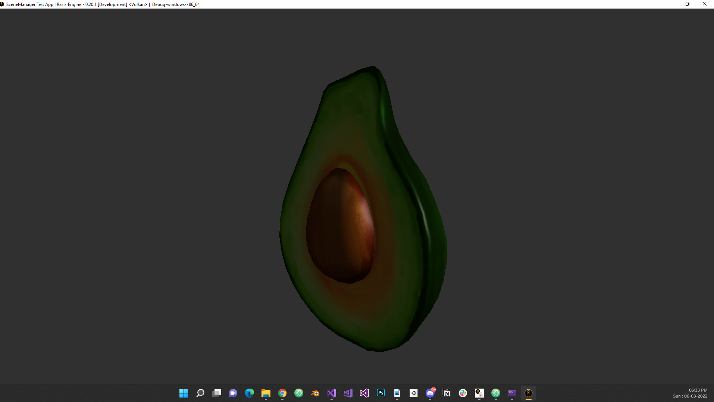
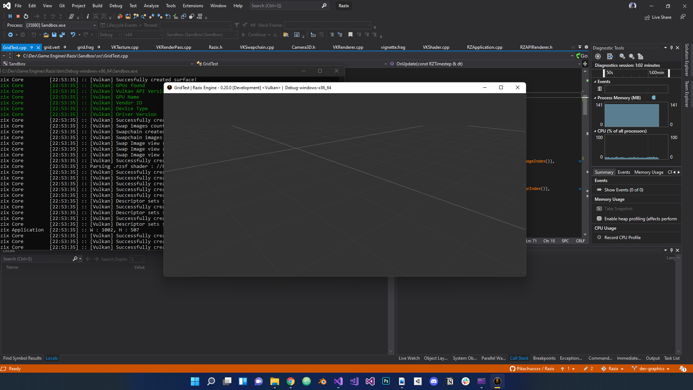
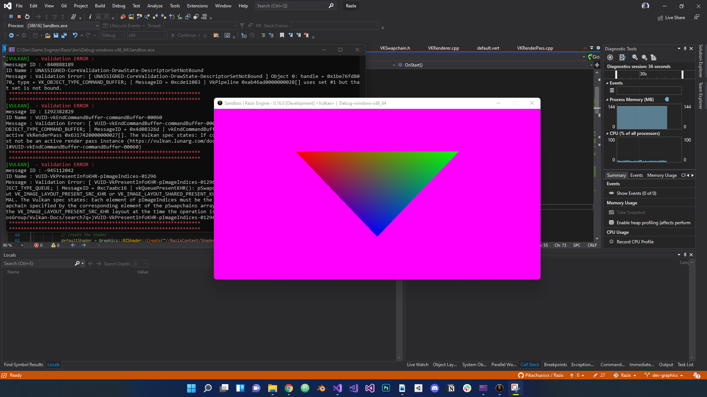
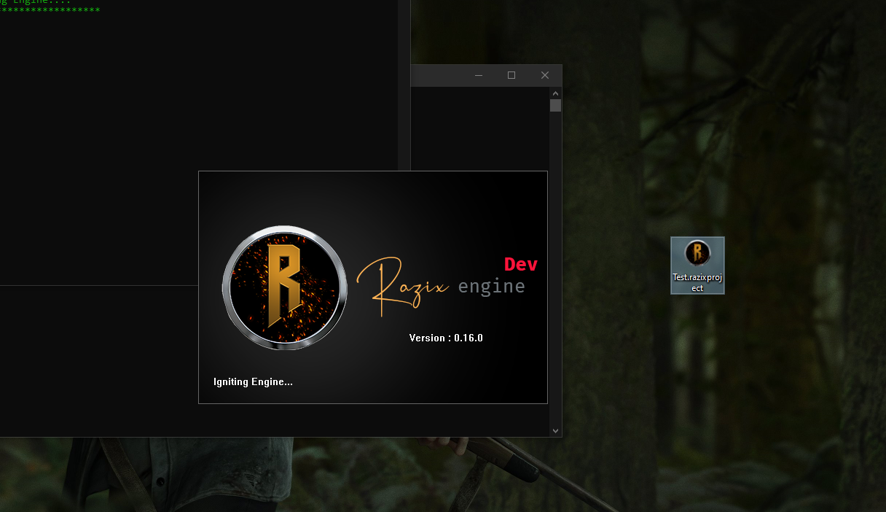

# Razix Engine Changelog

#### Version - 0.49.0 [Development] - 25/11/2025
- Re-wrote the RHI backend in C99 with full VK and DX12 backend support
- loads of custom STL (RZDynamicArray, RZHashMap etc.)
- removed redundant stuff and improved rendering
- Added lot of engine/gfx tests
- loads of stablitiy and c improvements

#### Version - 0.49.0 [Development] - 23/06/2025

##### Major Changes
-   Added Transient Resource Allocator skeleton with aliasing support
-   Refactored FrameGraph:
    -   Added lifetime tracking to FGResources
    -   Determined aliasing groups per resource entry
    -   Implemented per-frame transient resource reuse
-   Added UUID fix: consistent pretty string ↔ byte conversion (Fixes #340)
-   Renamed "Diana" to "House" for scene-to-GPU data synthesis architecture
-   Unified Gfx structs and added handles across graphics API
-   Switched Vulkan backend to use HLSL
-   Removed QT-based editor; switching to Blender-based asset workflow
-   Moved STL, memory, and Core into monolithic libraries

##### Frame Graph Visualizer Tool (FGVisTool)
-   Lifetime visualization with pass-based lifetime cells
-   Improved styling and layout consistency
-   Removed hardcoded constants
-   Debug utilities for dangling/dangling-writeonly entries
-   Proper aliasing group detection and visualization

##### DX12 Backend Preparation & Restore
These changes provide a stable Vulkan baseline for DX12 backend porting:
-   Restored Debug Draw and ImGui passes for Vulkan
-   Restored basic PBR IBL deferred rendering pipeline:
    -   Materials with SoA layout
    -   GBuffer
    -   PBR + IBL using CookTorrance
    -   Tonemapping pass
-   Restored HelloTriangle, HelloTexture, and Wave Intrinsics tests
-   Enabled GLM compatibility mode to use float4x4 etc. with HLSL style (#401)

##### Barriers and Resource Synchronization
-   Automatic barrier system implemented for Frame Graph resources (#400)
-   Fixed bugs with memory/layout barriers on resized attachments (#405)
-   Removed redundant buffer memory barriers (#407)

##### Testing Framework & Gfx Tests
-   Added GfxTestRunner with automatic test registration
-   Engine GFX tests:
    -   Screenshot comparison (RMS error)
    -   PPM golden image output
    -   Hello World graphics tests (x3)
-   Existing unit tests pass without failure

##### Serialization & Logging
-   Fixed UUID pretty string (de)serialization bug (#340)
-   Added logging-to-file system (#404)

##### Miscellaneous Fixes & Improvements
-   Added basic DualSense controller support
-   Minor engine cleanups
    -   Window resize bugs
    -   Script/test infra for Mac and CI
-   Fixed crash when project resolution > monitor resolution (#410)
-   Removed unwanted/redundant engine code

#### Version - 0.43.0 [Development] - 16/09/2023
    - Graphics API uses handles and resource manager/pools
    - improved frame graph; data-driven frame graph wip;
    - gained even more performance
    - fixed PBR lighting model
    - Editor minor improvements

#### Version - 0.42.0 [Development] - 02/07/2023
    - Single command buffer per frame
    - Improved synchronization and command buffer management 
    - Gained performance
    - Minor improvements and fixes
    - AABB boundingboxes can be visualised for all meshes now
    - Disabled imgui; fg resource barriers WIP

#### Version - 0.41.2 [Development] - 04/06/2023    
    - Patch for crash
#### Version - 0.41.1 [Development] - 04/06/2023
    - Patch for crash

#### Version - 0.41.0 [Development] - 04/06/2023
    
    - Added custom mesh and model formats and loaders for engine and RazixAssetPacker project
    - Improved editor controls
    - Improves scene Hierarchy and resolved issues
    - Added FrameGraph Editor project

#### Version - 0.40.0 [Development] - 08/04/2023

    
    - Added Frame Graph inspired from Frostbiet engine
    - added GBuffer, Shadow mapping, PBR + IBL lighting model
    - Imporved editing => Added material editor
    - Single world renderer to build the entire frame graph
    - Redesigned rendering architecture
    - used new vulkan dynamic rendering extension

#### Version - 0.30.0 [Development] - 06/03/2022

    - Added Entity Component System with entities
    - Added Robust Scene System and Scene Manager
    - Added multiple components such as Transform, Tag, ID, Camera, Meshrenderer, Sprite Renderer etc.
    - Added Model, Mesh and Sprite primitieves with utilities
    - Added loaders for OBJ, FBX and GLTF2.0
    - Added test sandbox scenarios to test the above

#### Version - 0.20.1 [Development] - 16/01/2022

    - Added test grid shaders in rzsf language + fixed minor sync and resizing issues
    - Fixed minor issues with descriptor set API and Uniform binding
    - Added Render targets for off screen rendering simplification + Post processing
    - Added vignette shader + example
    - Fixed minor bug with project path serialization and de-serialization
    - Identified some critical swap images tearing bug

#### Version - 0.20.0 [Development] - 09/01/2022

    - Developed First draft of Engine Graphics API
    - Created Razix Code Editor tool for editing Shaders and scripts files + SonyWWS ATF as vendor for tools and editor
    - Added Vulkan Renderer and Graphips API abstractions for it (such as Descriptor sets, render passes, textures, framebuffers, etc)
    - Created Razix Shader File (-.rzsf) convention for cross compiling shaders (First draft)
    - Impoved styleguide rules and enforcement of branding conventions to the entire code base
    - Improved build system for tools and shaders and Initialiszed RZSTL(custom stl implementation for razix engine)
    - Improved design consistency for entire engine and reduced cyclic dependency

#### Version - 0.16.0 [Development] - 15/09/2021

    - Added Command line options for Engine application
    - Added -.razixproject file type registration for windows
    - Added splash screen to track Engine Ignition [WINDOWS ONLY]

#### Version - 0.15.0 [Development] - 12/09/2021
    - Added application serialization

#### Version - 0.14.0 [Development] - 02/07/2021
    - Added Engine Singleton
    - Added Engine Ignition with proper logging
    - Added VFS to Engine Ignition
    - Changed Entrypoint and VFS initiation

#### Version - 0.13.0 [Development] - 27/06/2021
    - Added OS independent FileSystem (Windows only implementation for now)
    - Added Virtual File system
    - Added Window Icon

#### Version - 0.12.0 [Development]
    - Refactored Premake build system to be more robust
    - Added Window and Input Abstraction for Windows(GLFW only)
    - Added OpenGL Context abstraction for graphics context

#### Version - 0.11.0 [Development]
    - Added basic layer system and ImGui
    - Added OS abstraction
    - Added Event system

#### Version - 0.10.0 [Development]
    - Added Application and Entry point
    - Added Logging system using spdlog
    - Added dependencies (glad, glfw, imgui, spdlog, premake)
    - Added premake build system
