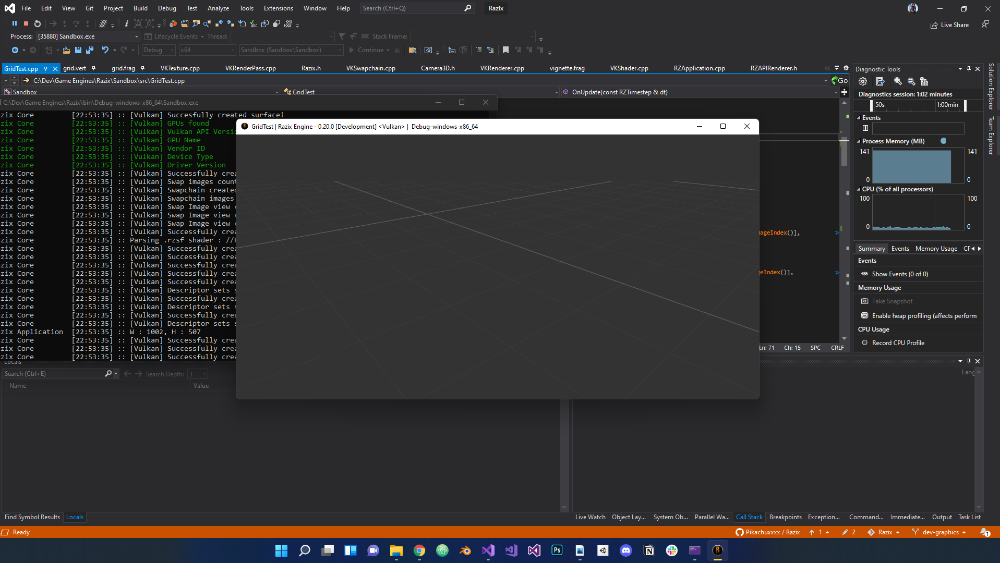

# Razix Engine Release Notes

## Version - 0.20.1 [Development] - 16/01/2022

- Added test grid shaders in rzsf language + fixed minor sync and resizing issues
- Fixed minor issues with descriptor set API and Uniform binding
- Added Render targets for off screen rendering simplification + Post processing
    - Added vignette shader + example
- Fixed minor bug with project path serialization and de-serialization
- Identified some critical swap images tearing bug

#### Known Issues
- some kind of tearing issues when camera moves super fast : [Issue #85](https://github.com/Pikachuxxxx/Razix/issues/85)
- Vulkan Swapchain or RT initial render target layout transition issue : [Issue #83](https://github.com/Pikachuxxxx/Razix/issues/83)
