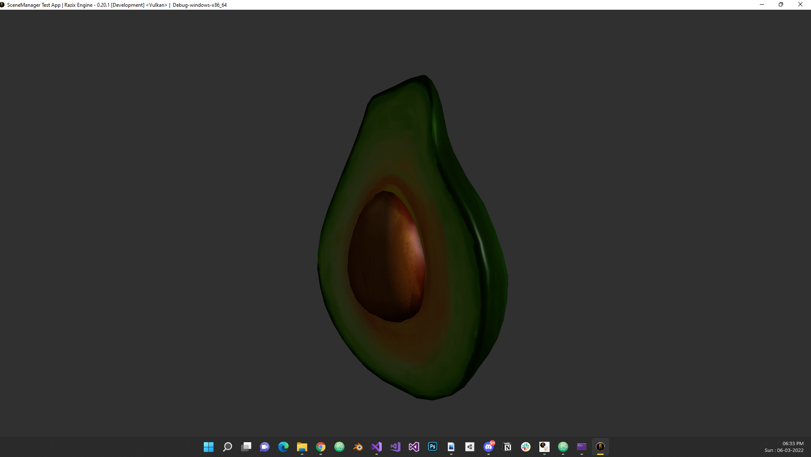

# Razix Engine Release Notes

## Version - 0.30.0 [Development] - 06/03/2022

    - Added Entity Component System with entities
    - Added Robust Scene System and Scene Manager
    - Added multiple components such as Transform, Tag, ID, Camera, Meshrenderer, Sprite Renderer etc.
    - Added Model, Mesh and Sprite primitieves with utilities
    - Added loaders for OBJ, FBX and GLTF2.0
    - Added test sandbox scenarios to test the above

#### Known Issues
- some kind of tearing issues when camera moves super fast : [Issue #85](https://github.com/Pikachuxxxx/Razix/issues/85)
- Vulkan Swapchain or RT initial render target layout transition issue : [Issue #83](https://github.com/Pikachuxxxx/Razix/issues/83)
- Cannot load Vulkan textures larger than 1024x1024 in dimenstion : [Issue #108](https://github.com/Pikachuxxxx/Razix/issues/108)
