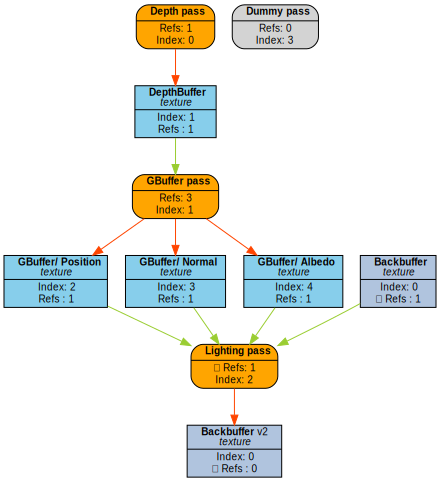

# FrameGraph

[](https://www.codefactor.io/repository/github/skaarj1989/framegraph)


This is a renderer agnostic implementation of **FrameGraph**, inspired by the **GDC** presentation:
[_FrameGraph: Extensible Rendering Architecture in Frostbite_](https://www.gdcvault.com/play/1024045/FrameGraph-Extensible-Rendering-Architecture-in) by Yuriy O'Donnell

## Table of contents

- [FrameGraph](#framegraph)
  - [Table of contents](#table-of-contents)
  - [How to use?](#how-to-use)
    - [Resources](#resources)
    - [Basic](#basic)
    - [Blackboard](#blackboard)
    - [Automatic resource bindings and barriers](#automatic-resource-bindings-and-barriers)
    - [Visualization](#visualization)
  - [Installation](#installation)
  - [Example](#example)
  - [License](#license)

## How to use?

### Resources

To integrate a resource with **FrameGraph**, the following requirements should be met.
**T** is a type meeting the requirements of **FrameGraph** resource.

| Expression                        | Type                                                                        | Description                                                                           |
| --------------------------------- | --------------------------------------------------------------------------- | ------------------------------------------------------------------------------------- |
| <pre lang="cpp">T{}</pre>         | <pre lang="cpp">T</pre>                                                     | Is default/move constructible.                                                        |
| <pre lang="cpp">T::Desc</pre>     | <pre lang="cpp">struct</pre>                                                | Resource descriptor.                                                                  |
| <pre lang="cpp">T::create</pre>   | <pre lang="cpp">void(const T::Desc &, void \*)</pre>                        | A function used by implementation to create transient resource.                       |
| <pre lang="cpp">T::destroy</pre>  | <pre lang="cpp">void(const T::Desc &, void \*)</pre>                        | A function used by implementation to destroy transient resource.                      |
| <pre lang="cpp">T::preRead</pre>  | <pre lang="cpp">void(const T::Desc &, uint32_t flags, void \*context)</pre> | _(optional)_<br/>A function called before an execution lambda of a pass.              |
| <pre lang="cpp">T::preWrite</pre> | <pre lang="cpp">void(const T::Desc &, uint32_t flags, void \*context)</pre> | _(optional)_<br/>A function called before an execution lambda of a pass.              |
| <pre lang="cpp">T::toString</pre> | <pre lang="cpp">std::string(const T::Desc &)<pre>                           | _(optional)_<br/>Static function used to embed resource descriptor inside graph node. |

### Basic

```cpp
#include "fg/FrameGraph.hpp"

void renderFrame() {
  FrameGraph fg;

  struct PassData {
    FrameGraphResource target;
  };
  fg.addCallbackPass<PassData>("SimplePass",
    [&](FrameGraph::Builder &builder, PassData &data) {
      data.target = builder.create<FrameGraphTexture>("Foo", { 1280, 720 });
      data.target = builder.write(data.target);
    },
    [=](const PassData &data, FrameGraphPassResources &resources, void *) {
      auto &texture = resources.get<FrameGraphTexture>(data.target);
      // ...
    }
  );

  fg.compile();
  fg.execute(&renderContext);
}
```

### Blackboard

Communication between modules

```cpp
#include "fg/FrameGraph.hpp"
#include "fg/Blackboard.hpp"

struct GBufferData {
  FrameGraphResource depth;
  FrameGraphResource normal;
  FrameGraphResource albedo;
};
GBufferPass::GBufferPass(FrameGraph &fg, FrameGraphBlackboard &blackboard,
                         std::span<const Renderable> renderables) {
  blackboard.add<GBufferData>() = fg.addCallbackPass<GBufferData>(
    "GBuffer Pass",
    [&](FrameGraph::Builder &builder, GBufferData &data) {
      data.depth = builder.create<FrameGraphTexture>(
        "SceneDepth", {/* extent, pixelFormat ... */});
      data.depth = builder.write(data.depth);

      data.normal = builder.create<FrameGraphTexture>("Normal", {});
      data.normal = builder.write(data.normal);

      data.albedo = builder.create<FrameGraphTexture>("Albedo", {});
      data.albedo = builder.write(data.albedo);
    },
    [=](const GBufferData &data, FrameGraphPassResources &resources,
        void *ctx) {
      auto &rc = *static_cast<RenderContext *>(ctx);
      rc.beginRenderPass({
        resources.get<FrameGraphTexture>(data.depth),
        resources.get<FrameGraphTexture>(data.normal),
        resources.get<FrameGraphTexture>(data.albedo),
      });
      for (const auto &renderable : renderables)
        drawMesh(rc, renderable.mesh, renderable.material);
      rc.endRenderPass();
    });
}

struct SceneColorData {
  FrameGraphResource hdr;
};
DeferredLightingPass::DeferredLightingPass(FrameGraph &fg,
                                           FrameGraphBlackboard &blackboard) {
  const auto &gBuffer = blackboard.get<GBufferData>();

  blackboard.add<SceneColorData>() = fg.addCallbackPass<SceneColorData>(
    "GBuffer Pass",
    [&](FrameGraph::Builder &builder, SceneColorData &data) {
      builder.read(gBuffer.depth);
      builder.read(gBuffer.normal);
      builder.read(gBuffer.albedo);

      data.hdr = builder.create<FrameGraphTexture>("SceneColor", {});
      data.hdr = builder.write(data.hdr);
    },
    [=](const SceneColorData &data, FrameGraphPassResources &resources,
        void *ctx) {
      auto &rc = *static_cast<RenderContext *>(ctx);
      rc.beginRenderPass({resources.get<FrameGraphTexture>(data.hdr)})
        .bindTextures({
          resources.get<FrameGraphTexture>(gBuffer.depth),
          resources.get<FrameGraphTexture>(gBuffer.normal),
          resources.get<FrameGraphTexture>(gBuffer.albedo),
        })
        .drawFullScreenQuad()
        .endRenderPass();
    });
}

void renderFrame(std::span<const Renderable> renderables) {
  FrameGraph fg;
  FrameGraphBlackboard blackboard;

  GBufferPass{fg, blackboard, renderables};
  DeferredLightingPass{fg, blackboard};

  fg.compile();
  fg.execute(&renderContext);
}
```

### Automatic resource bindings and barriers

Implement `preRead/preWrite` in a resource struct.

_Code snippets taken from my Vulkan renderer_

```cpp
// For convenience, use an implicit conversion operator.

struct Attachment /* 21 bits */ {
  uint32_t index{0};
  std::optional<uint32_t> layer;
  std::optional<uint32_t> face;
  std::optional<ClearValue> clearValue;

  operator uint32_t() const;
};
Attachment decodeAttachment(uint32_t flags);

struct Location /* 7 bits */ {
  uint32_t set{0};
  uint32_t binding{0};

  operator uint32_t() const;
};
Location decodeLocation(uint32_t flags);

struct BindingInfo /* 13 bits */ {
  Location location;
  uint32_t pipelineStage{0};

  operator uint32_t() const;
};
BindingInfo decodeBindingInfo(uint32_t flags);

struct TextureRead /* 15 bits */ {
  BindingInfo binding;

  enum class Type { CombinedImageSampler, SampledImage, StorageImage }; // 2 bits
  Type type;

  operator uint32_t() const;
};
TextureRead decodeTextureRead(uint32_t flags);
```

```cpp
struct FrameGraphTexture {
  struct Desc { /* extent, pixel format ... */ };

  void preRead(const Desc &desc, uint32_t flags, void *ctx) {
    auto &rc = *static_cast<RenderContext *>(ctx);
    // Decode flags, build DescriptorSet tables, insert barriers
  }
  void preWrite(const Desc &desc, uint32_t flags, void *ctx) {
    auto &rc = *static_cast<RenderContext *>(ctx);
    // Decode flags, build attachments (e.g VkRenderingInfo), insert barriers
  }
};
```

```cpp
struct Data {
  FrameGraphResource output;
};
fg.addCallbackPass<Data>(
  "FXAA",
  [&](FrameGraph::Builder &builder, Data &data) {
    builder.read(input, TextureRead{
                          .binding =
                            {
                              .location = {.set = 2, .binding = 0},
                              .pipelineStage = PipelineStage_FragmentShader,
                            },
                          .type = TextureRead::Type::CombinedImageSampler,
                        });

    const auto &inputDesc = fg.getDescriptor<FrameGraphTexture>(input);
    data.output = builder.create<FrameGraphTexture>("AA", inputDesc);
    data.output = builder.write(data.output, Attachment{.index = 0});
  },
  [=](const Data &, const FrameGraphPassResources &, void *ctx) {
    auto &rc = *static_cast<RenderContext *>(ctx);
    renderFullScreenPostProcess(rc);
  });
```

### Visualization

```cpp
std::ofstream{"fg.dot"} << fg;
```


_(Graph created by one of tests)_

## Installation

```bash
git submodule init
git submodule add https://github.com/skaarj1989/FrameGraph.git extern/FrameGraph
```

```cmake
add_subdirectory(extern/FrameGraph)
target_link_libraries(YourProject PRIVATE fg::FrameGraph)
```

Another possibility is to use [FetchContent](https://cmake.org/cmake/help/latest/module/FetchContent.html):

```cmake
include(FetchContent)

FetchContent_Declare(
  FrameGraph
  GIT_REPOSITORY https://github.com/skaarj1989/FrameGraph.git
  GIT_TAG master)
FetchContent_MakeAvailable(FrameGraph)

target_link_libraries(YourProject PRIVATE fg::FrameGraph)
```

## Example

https://github.com/skaarj1989/FrameGraph-Example

## License

[MIT](LICENSE)
