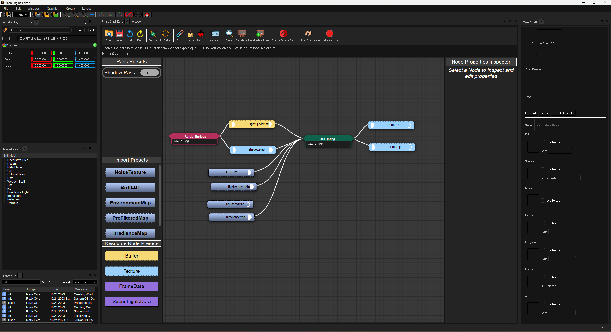
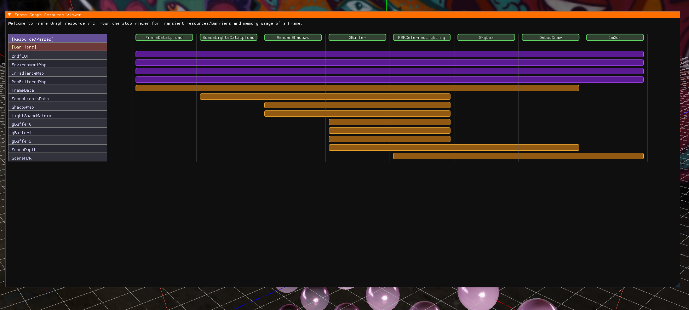
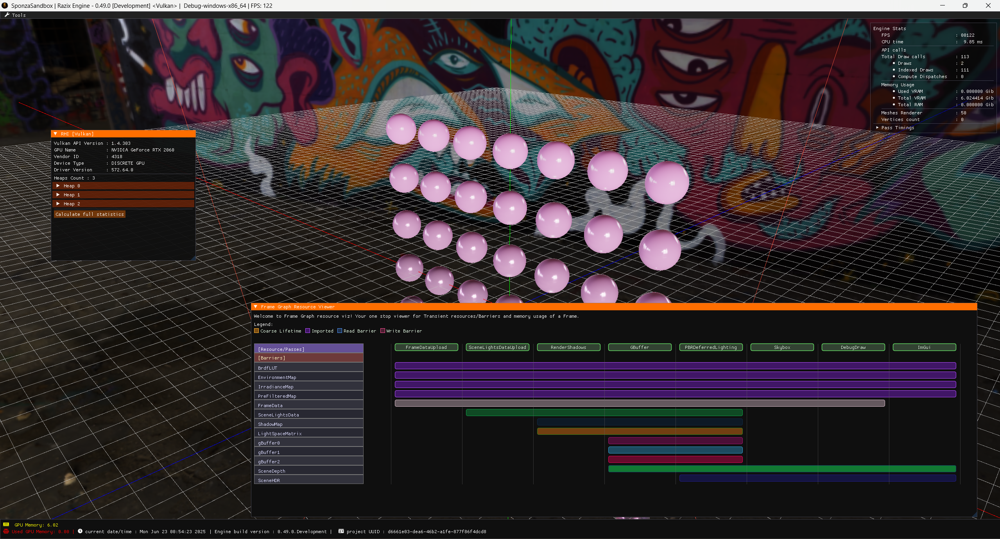
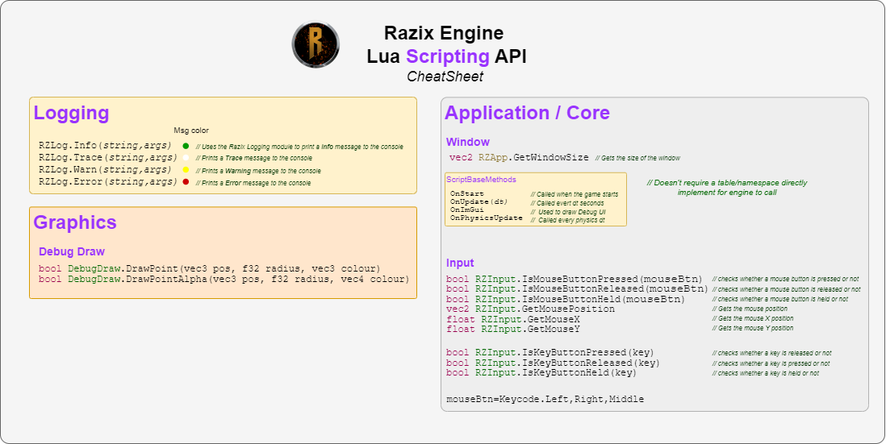

<br>
 <h1> Razix Engine </h1>
Razix is a High Performance Engine for experimenting with different rendering techniques. Razix supports Windows, Mac, Linux.   

---

THIS ENGINE IS BEING MADE FOR A GAME called "Tanu"! not a generic engine, I'll have the GDD/Story etc. soon here! For now I have the mood board and broad storkes of the game. It's a first person narrative driven action-puzzle game, with a duration of 2-3 hours.

_Tanu = Body/Her_

Tanu Mood Board:


[tanu_mood.txt — thoughts about the direction of the game](./Tanu/Design/tanu_mood.txt)

# About
Razix is a cross-Platform 3D engine with multi render API support (Vulkan, DirectX 12). It's being built on a new design principle of **"Everything is as asset"** to replace traditonal 
gameobject and ECS systems and primarily focusing on making a game one day soon. I have a game idea that I'll be showcasing using the engine in 2025 hopefully, 
eventually I hope razix will be mature enough one day. It's also my portfolio + practice sandbox for making a trippy game.

View the [Trello Board](https://trello.com/b/yvWKH1Xr/razix-engine) and the [Architecture notes on Draw.io](https://drive.google.com/file/d/1y5ZFf-h02z3cx6WmUzR8giKScvORzmwx/view?usp=sharing)

# Features
- **Game/Engine Built using C++17 and a beautiful C99 RHI API** 
- Support for Windows, Linux, macOS.
- Support for Vulkan & DirectX 12.
- **Data Driven** Framegraph based on EA's frostbite engine (based on [skaarj
1989's Framegraph implementation](https://github.com/skaarj1989/FrameGraph))  
    - **Uses Custom [Node Graph Editor](https://github.com/Pikachuxxxx/QtNodeGraph)**

| Node based <br /> Frame Graph Editor  |  |  
| ------------- | ------------- |

| FrameGraph lifetimes  |  |  
| ------------- | ------------- |

- 3D audio using OpenAL
- Complete Deferred pipeline + Bindless resources + nanite-like renderers (Future support for customizable render graph editor for complete control).
- Runtime tools using ImGui + Blender Support as level editor
- 3D physics using Jolt.
- Basic Lua scripting support
- Extremely detailed profiling using Tracy and RenderDoc integrated
- Supports HLSL shading language to create custom materials + Custom Razix Shaders files for easy compilation
- Resource Pool base management and custom asset format
- Data drive pipeline architecture - FrameGraph uses JSON files
- Custom containers and memory pools and library for tracking
- **WorldRenderer** Passes
	- Lighting and shadows 
		- Directional lights with CSM (Cascaded Shadow Mapping)
		- Point lights
		- Spot lights
	- Deferred PBR 
	- IBL
	- Skybox (HDR & Procedural)
	- SSAO
	- Debug Drawing
	- ImGui
	- Tonemapping
	- FXAA
	- TAA (WIP)

**Experimental features:**
  - Machine Learning sandbox (custom NNs class + Transformers WIP) CPU only for now, later might be ported over the engine RHI layer
  - Department based memory/frame time budget profiling (inspiration from SMS GDC talk and Insomniac engine)
  - I have a secret RazixGPT build in rust might use it for game NPCs one day.

DirectX11, OpenGL has been deprecated. Only high-level APIs and RTX level GPUs will be supported. PSVita(GXM) and PS3(GCM) will be supported sometime far in future.

# RoadMap

## V 1.0.0 - RC


# Screenshots/Demos


# Building Razix Engine

## Prerequisites

### General Requirements
- **Git** for cloning the repository
- **Python 3.x** for build and test scripts
- **Vulkan SDK 1.3.290.0** or later

### Platform-Specific Requirements

**Windows:**
- Visual Studio 2022 (Community, Professional, or Enterprise)
- Windows 10/11 (x64)
- Windows SDK 10.0.22000.0 or later (minimum required)

**macOS:**
- Xcode Command Line Tools
- macOS 10.15 or later
- ARM64 (Apple Silicon) or x86_64 architecture

**Linux:**
- GCC 9+ or Clang 10+
- Development packages (see installation section below)

## Supported Platforms and Compilers

### Tested Configurations

**Compilers:**
- **MSVC**: Visual Studio 2022 (v143 toolset)
- **GCC**: 9.0+ (tested with GCC 11)
- **Clang**: 10.0+ (tested with Clang 12)

**Architectures:**
- **ARM64 Only**: Apple Silicon (M1/M2/M3), ARM-based Windows devices, ARM64 Linux systems

**Verified Platforms:**
- **Windows 11** (x64, ARM64) with Windows SDK 10.0.22000.0+
- **macOS** (Apple M2 Silicon Macbook Pro 2022)
- **Debian Linux** (x64, ARM64)

## Vulkan SDK Installation

### Windows

1. **Download and Install:**
   ```cmd
   # Download VulkanSDK 1.3.290.0 from https://vulkan.lunarg.com/sdk/home#windows
   # Run the installer with default settings
   ```

2. **Verify Installation:**
   ```cmd
   echo %VULKAN_SDK%
   # Should show: C:\VulkanSDK\1.3.290.0
   ```

### macOS

1. **Download and Install:**
   ```bash
   # Download VulkanSDK 1.3.290.0 from https://vulkan.lunarg.com/sdk/home#mac
   # Mount the DMG and run InstallVulkan app
   # Install to default location: ~/VulkanSDK/1.3.290.0
   ```

2. **Set Environment Variables:**
   Add to your shell profile (`~/.zshrc` or `~/.bash_profile`):
   ```bash
   export VULKAN_SDK="$HOME/VulkanSDK/1.3.290.0/macOS"
   export PATH="$VULKAN_SDK/bin:$PATH"
   ```

3. **Apply and Verify:**
   ```bash
   source ~/.zshrc
   echo $VULKAN_SDK
   vulkaninfo --summary
   ```

### Linux

#### Method 1: Package Manager (Ubuntu/Debian)

1. **Add LunarG Repository:**
   ```bash
   # Add GPG key
   wget -qO - https://packages.lunarg.com/lunarg-signing-key-pub.asc | sudo apt-key add -
   
   # Ubuntu 22.04
   sudo wget -qO /etc/apt/sources.list.d/lunarg-vulkan-1.3.290-jammy.list \
     https://packages.lunarg.com/vulkan/1.3.290/lunarg-vulkan-1.3.290-jammy.list
   
   # Ubuntu 20.04
   sudo wget -qO /etc/apt/sources.list.d/lunarg-vulkan-1.3.290-focal.list \
     https://packages.lunarg.com/vulkan/1.3.290/lunarg-vulkan-1.3.290-focal.list
   ```

2. **Install:**
   ```bash
   sudo apt update
   sudo apt install vulkan-sdk
   ```

#### Method 2: Manual Installation (All Distributions)

1. **Download SDK:**
   ```bash
   cd ~/Downloads
   
   # x86_64
   wget https://sdk.lunarg.com/sdk/download/1.3.290.0/linux/vulkansdk-linux-x86_64-1.3.290.0.tar.xz
   
   # ARM64
   wget https://sdk.lunarg.com/sdk/download/1.3.290.0/linux/vulkansdk-linux-aarch64-1.3.290.0.tar.xz
   ```

2. **Extract and Setup:**
   ```bash
   mkdir -p ~/VulkanSDK
   cd ~/VulkanSDK
   
   # Extract (adjust filename for your architecture)
   tar -xf ~/Downloads/vulkansdk-linux-x86_64-1.3.290.0.tar.xz
   ```

3. **Environment Configuration:**
   Add to `~/.bashrc` or `~/.zshrc`:
   ```bash
   # Vulkan SDK Environment
   export VULKAN_SDK="$HOME/VulkanSDK/1.3.290.0/x86_64"
   export PATH="$VULKAN_SDK/bin:$PATH"
   export LD_LIBRARY_PATH="$VULKAN_SDK/lib:$LD_LIBRARY_PATH"
   export VK_LAYER_PATH="$VULKAN_SDK/etc/vulkan/explicit_layer.d"
   
   # For ARM64, use: export VULKAN_SDK="$HOME/VulkanSDK/1.3.290.0/aarch64"
   ```

4. **Apply and Verify:**
   ```bash
   source ~/.bashrc
   echo $VULKAN_SDK
   vulkaninfo --summary
   ```

#### Install Development Packages

**Ubuntu/Debian:**
```bash
sudo apt install build-essential libxrandr-dev libxinerama-dev libxcursor-dev \
                 libxi-dev libgl1-mesa-dev libvulkan1 vulkan-tools vulkan-validationlayers-dev
```

**Fedora/RHEL:**
```bash
sudo dnf groupinstall "Development Tools"
sudo dnf install vulkan-devel vulkan-tools vulkan-validation-layers-devel \
                 libXrandr-devel libXinerama-devel libXcursor-devel libXi-devel mesa-libGL-devel
```

**Arch Linux:**
```bash
sudo pacman -S base-devel vulkan-devel vulkan-tools vulkan-validation-layers \
               libxrandr libxinerama libxcursor libxi mesa
```

## Building the Engine

### 1. Clone Repository
```bash
git clone https://github.com/Pikachuxxxx/Razix.git
cd Razix
```

### 2. Generate Project Files

#### Using Provided Scripts (Recommended)

**Windows:**
```cmd
cd Scripts
GenerateVS22.bat
```

**macOS:**
```bash
cd Scripts
chmod +x GenerateXCodeProjectsMacOS.sh
./GenerateXCodeProjectsMacOS.sh
```

**For Linux please use the below manual methods to generate make files**

#### Manual Generation with Premake

**Windows:**
```cmd
# Visual Studio 2022 (x64)
premake5 vs2022

# ARM64
premake5 vs2022 --arch=arm64
```

**Linux:**
```bash
# x64 (Intel/AMD)
premake5 gmake2 --os=linux --arch=x64

# ARM64 (ARM processors, Raspberry Pi, etc.)
premake5 gmake2 --os=linux --arch=arm64
```

**macOS:**
```bash
# Apple Silicon (M1/M2/M3)
premake5 gmake2 --os=macosx --arch=arm64

# Xcode project (recommended)
premake5 --os=macosx --arch=arm64 xcode4
```

### 3. Build

#### Using Python Build Script (Recommended)

The build script supports only `Debug` and `GoldMaster` configurations.

**Usage:**
```bash
python build_razix.py --platform <platform> [--config <Debug|GoldMaster>] [--github-ci] [--args ...]
```

- `--platform`: Target platform (`windows-x86_64`, `windows-arm64`, `macosx-arm64`, `linux-x86_64`, `linux-arm64`). **Required**
- `--config`: Build configuration (choices: `Debug`, `GoldMaster`). Defaults to `Debug`
- `--github-ci`: Use GitHub CI MSBuild path (Enterprise edition)
- `--args`: Additional arguments to pass to the build executable

**Examples:**
```cmd
python build_razix.py --platform windows-x86_64 --config Debug
python build_razix.py --platform macosx-arm64 --config GoldMaster
```

#### Manual Building

**Windows (Visual Studio):**
```cmd
# Open build/Razix.sln in Visual Studio 2022
# Or build from command line:
msbuild build/Razix.sln /p:Configuration=Debug /p:Platform=x64
msbuild build/Razix.sln /p:Configuration=GoldMaster /p:Platform=x64
```

**Linux:**
```bash
cd build
make -j$(nproc) config=debug      # Debug build
make -j$(nproc) config=goldmaster # GoldMaster (distribution) build
```

**macOS:**
```bash
cd build
make -j$(sysctl -n hw.ncpu) config=debug      # Debug build
make -j$(sysctl -n hw.ncpu) config=goldmaster # GoldMaster build
```

### 4. Running Tests

**Usage:**
```bash
python test_runner.py --config <Debug|GoldMaster> --platform <platform> [--verbose] [--github-ci] [--args ...]
```
- `--config`: Build config (choices: `Debug`, `GoldMaster`; default: `Debug`)
- `--platform`: Platform (choices: `windows-x86_64`, `windows-arm64`, `macosx-arm64`, `linux-x86_64`, `linux-arm64`; default: `windows-x86_64`)
- `--verbose`: Show test output in console
- `--github-ci`: Skips engine gfx tests on GitHub CI as it's GPU dependent
- `--args`: Additional arguments to pass to test executables

**Examples:**
```bash
python test_runner.py --config Debug --platform windows-x86_64
python test_runner.py --config GoldMaster --platform macosx-arm64 --verbose
```

**Only `Debug` and `GoldMaster` build configurations are supported.**

---

## Build Output

Successful builds generate:
- **Engine libraries**: `bin/[Config]-[Platform]/`
- **Executables**: Same directory as libraries
- **Intermediate files**: `build/intermediates/`

## Troubleshooting

### Common Issues

**Vulkan SDK Issues:**
- Ensure `VULKAN_SDK` environment variable is set correctly
- Restart terminal/IDE after installation
- On Linux: `sudo apt install vulkan-tools libvulkan-dev`

**Windows SDK Issues:**
- Ensure Windows SDK 10.0.22000.0 or later is installed
- Verify Visual Studio 2022 includes C++ development tools
- Using older windows SDK version can result in D3D12 ID3Device10 missing errors and compilation issues

**Script Permissions (Linux/macOS):**
```bash
chmod +x Scripts/GenerateXCodeProjectsMacOS.sh
```

**Missing Dependencies:**
- Follow the development packages installation for your Linux distribution above

## Neovim + LSP Support

### Generating compile_commands.json

Use Premake's gmake2 generator with bear to automatically generate `compile_commands.json` for LSP:

```bash
# Generate makefiles
premake5 gmake2 --arch=<your preferred arch> --os=<your preferred os>

# Install bear
sudo apt install bear  # Ubuntu/Debian
# or
brew install bear      # macOS

# Generate compile_commands.json
cd build
bear -- make -j$(nproc)
# move it to root directory as source and open nvim from the same directory
cp compile_commands.json ../
```

### clangd Installation on ARM64 Linux

**Mason.nvim workaround for ARM64:**

If Mason fails to install clangd on ARM64 Linux, install manually:

```bash
# Option 1: System package
sudo apt install clangd-15
sudo update-alternatives --install /usr/bin/clangd clangd /usr/bin/clangd-15 100

# Option 2: Download from LLVM releases
wget https://github.com/llvm/llvm-project/releases/download/llvmorg-15.0.0/clang+llvm-15.0.0-aarch64-linux-gnu.tar.xz
tar -xf clang+llvm-15.0.0-aarch64-linux-gnu.tar.xz
sudo cp clang+llvm-15.0.0-aarch64-linux-gnu/bin/clangd /usr/local/bin/
```

**LSP Config:**
```lua
require("lspconfig").clangd.setup({
  cmd = { "clangd", "--compile-commands-dir=." },
  root_dir = require("lspconfig.util").root_pattern("compile_commands.json", ".git"),
})
```

**Related Issue:** [mason-org/mason-registry#5800](https://github.com/mason-org/mason-registry/issues/5800)

# Architecture

#### :warning: Still a work in progress


**ex. Lua Scripting API cheatsheet** 

**Check the Docs folder or [Architecture notes on Draw.io](https://drive.google.com/file/d/1y5ZFf-h02z3cx6WmUzR8giKScvORzmwx/view?usp=sharing) for a detailed architecture description**

| Core Systems | Frame Graph |
| ----------- | ---------- |
|   |   |


# Contributing
More information will be update on creating PRs and other ways to contribute to Razix Engine.

### Style Guide
Check the [style guide](./Docs/RazixStyleGuide.md) for Razix Style enforcements

# Changelog and Release Notes

[Click to view changelog](./Docs/CHANGELOG.md)

[Click to view ReleaseNotes](./Docs/ReleaseNotes.md)

# License
Razix Engine is distributed under Apache 2.0 license. [LICENSE](https://github.com/Pikachuxxxx/Razix/blob/master/LICENSE)