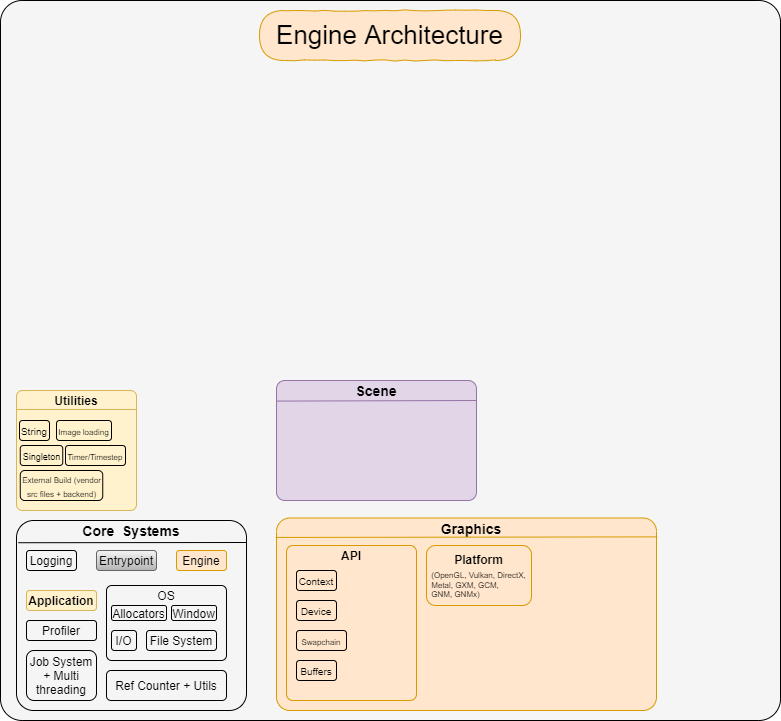

 
 <h1> Razix Engine </h1>
Razix is a High Performance Research Engine for production pipeline with emphasis on experimenting with different rendering techniques. Razix supports Windows, Mac, Linux, PSVita and PS3 systems.

 ---

|:warning: WARNING:Currently Razix is WIP and the renderer is undergoing major design overhaul hence nothing will make sense |
| --- |

# About
Cross-Platform 2D and 3D engine with multi render API support (OpenGL, Vulkan DirectX 11, GXM, GCM, GNM and GNMX). Supports a wide range of Renders with extreme emphasis on scene optimization and implementing state-of-the art rendering techniques. The engine architecture supports a very educational and optimized design.

# Features
- Support for Windows, Linux, macOS, PSVita, PS3 and PS4 systems.
- Support for OpenGL, Vulkan DirectX 11, GXM, GCM, GNM and GNMX.
- 3D audio using OpenAL.
- Rendering 3D models with deferred PBR shading.
- Editor GUI using ImGui.
- Multi Physics engine support.
- 3D physics using PhysX, Bullet and Havok.
- 2D physic using Box2D.
- Basic lua scripting support for entities.
- Extremely detailed profiling using Tracy, RenderDoc and Razor integrated deep into the engine systems.
- Custom Animation and state machine engine and supports Havok Animation system
- Supports GLSL, HLSL and PSSL shading languages to create custom materials
- Supports Hull, Domain, Geometry, Compute shaders for all Platforms
- Asset streaming pipeline and custom asset format
- Future support for Falcor and Render Graph Editor

# Architecture

#### :warning: Still a work in progress

**For individual module architecture and documentation check the Docs folder or check the individual folders for a detailed description (ex. )**

# To be Updated...

[Click to view changelog](./Docs/CHANGELOG.md)

[Click to view ReleaseNotes](./Docs/ReleaseNotes.md)

# License
Razix Engine is distributed under Apache 2.0 license. [LICENSE](https://github.com/Pikachuxxxx/Razix/blob/master/LICENSE)
