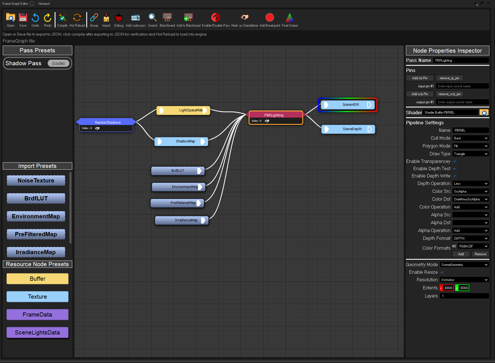

 
 <h1> Razix Engine </h1>
Razix is a High Performance Research Engine for production pipeline with emphasis on experimenting with different rendering techniques. Razix supports Windows, Mac, Linux, PSVita and PS3 systems.

 ---

|:warning: WARNING:Currently Razix is WIP and the renderer is undergoing major design overhaul thread with caution while using, check the RoadMap below for release information |
| --- |

# About
Cross-Platform 2D and 3D engine with multi render API support (Vulkan, DirectX 12). Supports a wide range of Renders with extreme emphasis on scene optimization and implementing state-of-the art rendering techniques. The engine architecture supports a very educational and optimized design.

View the [Trello Board](https://trello.com/b/yvWKH1Xr/razix-engine) and the [Architecture notes on Draw.io](https://drive.google.com/file/d/1y5ZFf-h02z3cx6WmUzR8giKScvORzmwx/view?usp=sharing)

# Features
- Built using C++17. (Engine will be reverted back to C++14 once entt/sol have been removed and only Jolt will be compiled in C++17 mode)
	- C++14 over C++11 because `constexpr` and `sizeof` and improved `lamdbas` are needed for framegraph.
- Support for Windows, Linux, macOS.
- Support for OpenGL, Vulkan & DirectX 12.
- **Data Driven** Framegraph based on EA's frostbite engine (based on [skaarj
1989's Framegraph implementation](https://github.com/skaarj1989/FrameGraph))  
    - **Uses Custom [Node Graph Editor](https://github.com/Pikachuxxxx/QtNodeGraph)**

| Node based   Frame Graph Editor  |  |  
| ------------- | ------------- |

- 3D audio using OpenAL
- Complete Deferred pipeline + Bindless resources + nanite-like renderers(Future support for customizable render graph editor for complete control).
- Level Editor & tools built using QT
- Multi Physics engine support.
- 3D physics using Jolt.
- Basic lua scripting support for entities.
- Extremely detailed profiling using Tracy and RenderDoc integrated
- Supports GLSL, HLSL shading languages to create custom materials + Custom Razix Shaders files for easy compilation
- Resource Pool base management and custom asset format

| Resource Viewer |  |  
| ------------- | ------------- |

- Data drive pipeline architecture - FrameGraph uses JSON files
- Custom [Razix STL](https://github.com/Pikachuxxxx/RZSTL) and [Razix Memory](https://github.com/Pikachuxxxx/RazixMemory)
- **WorldRenderer** Passes
	- Lighting and shadows 
		- Directional lights with CSM (Cascaded Shadow Mapping)
		- Point lights
		- Spot lights
	- Deferred PBR 
	- IBL
	- Skybox (HDR & Procedural)
	- SSAO
	- Debug Drawing
	- ImGUi
	- Tonemapping
	- FXAA
	- TAA (WIP)

**Experimental features:**
  - Machine Learning sandbox (custom NNs class + Transformers WIP) CPU only for now, later might be ported over the engine RHI layer
  - Department based memory/frame time budget profiling (inspiration from SMS GDC talk and Insomniac engine)

DirectX11, OpenGL has been deprecated. Only high-level APIs and RTX level GPUs will be supported. PSVita(GXM) and PS3(GCM) will be supported sometime far in future.

# Tools
Razix also provides a rich set of GUI and Commmand Line [**Tools**](https://github.com/Pikachuxxxx/Razix/tree/master/Tools) along with the Editor for various purposes such as
- [**Razix Asset Packer**](https://github.com/Pikachuxxxx/RazixAssetPacker) - **CLI Tool + API for Editor** - Export 3D Models into custom razix format Meshes and Materials

# RoadMap

## V 1.0.0 - RC

# Contributing
More information will be update on creating PRs and other ways to contribute to Razix Engine.
### Style Guide
Check the [style guide](./Docs/RazixStyleGuide.md) for Razix Style enforcements

# Screenshots/Demos

# Architecture

#### :warning: Still a work in progress

**ex. Lua Scriping API cheatsheet** 

**Check the Docs folder or [Architecture notes on Draw.io](https://drive.google.com/file/d/1y5ZFf-h02z3cx6WmUzR8giKScvORzmwx/view?usp=sharing) for a detailed architecture description**

| Core Systems | Frame Graph |
| ----------- | ---------- |
|   |   |

# Changelog and Release Notes

[Click to view changelog](./Docs/CHANGELOG.md)

[Click to view ReleaseNotes](./Docs/ReleaseNotes.md)

# License
Razix Engine is distributed under Apache 2.0 license. [LICENSE](https://github.com/Pikachuxxxx/Razix/blob/master/LICENSE)
