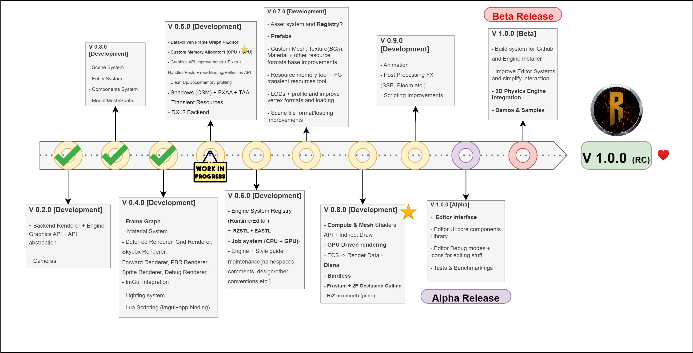
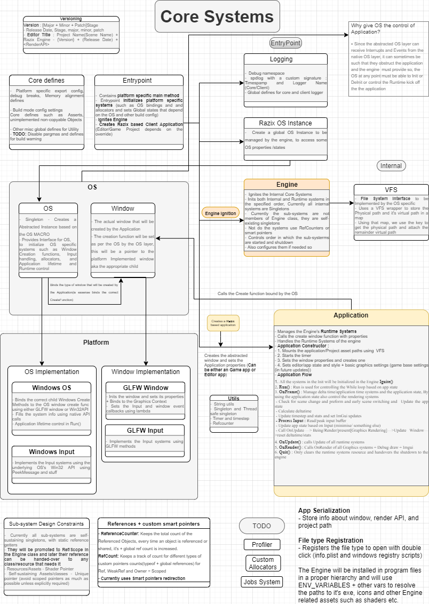

 
 <h1> Razix Engine </h1>
Razix is a High Performance Research Engine for production pipeline with emphasis on experimenting with different rendering techniques. Razix supports Windows, Mac, Linux, PSVita and PS3 systems.

 ---

|:warning: WARNING:Currently Razix is WIP and the renderer is undergoing major design overhaul hence nothing will make sense, check the RoadMap below for release information |
| --- |

# About
Cross-Platform 2D and 3D engine with multi render API support (OpenGL, Vulkan DirectX 11, GXM, GCM, GNM and GNMX). Supports a wide range of Renders with extreme emphasis on scene optimization and implementing state-of-the art rendering techniques. The engine architecture supports a very educational and optimized design.

View the [Trello Board](https://trello.com/b/yvWKH1Xr/razix-engine) and the [Architecture notes](https://drive.google.com/file/d/1y5ZFf-h02z3cx6WmUzR8giKScvORzmwx/view?usp=sharing)

# Features
- Support for Windows, Linux, macOS, PSVita and PS3 systems. (If you're a licensed PS developer check DevNet in future for potential releases that support next gen consoles)
- Support for OpenGL, Vulkan DirectX 11, GXM, GCM & GNM.
- 3D audio using OpenAL.
- Complete Deferred pipeline + Bindless resources + nanite-like renderers(Future support for customizable render graph editor for complete control).
- Level Editor & tools built using **[Sony WWS ATF](https://github.com/SonyWWS/ATF).**
- Multi Physics engine support.
- 3D physics using PhysX, Bullet and Jolt.
- 2D physic using Box2D.
- Basic lua scripting support for entities.
- Extremely detailed profiling using Tracy, RenderDoc and Razor integrated deep into the engine systems.
- Custom Animation and state machine engine
- Supports GLSL, HLSL and PSSL shading languages to create custom materials
- Supports Hull, Domain, Geometry, Compute shaders for all Platforms
- Asset streaming pipeline and custom asset format
- Future support for Falcor and Render Graph Editor
- Data drive pipeline architecture
- Custom [Razix STL](https://github.com/Pikachuxxxx/RZSTL) and [Razix Memory](https://github.com/Pikachuxxxx/RazixMemory)
                                                                                                          
                                                                                                          
# Tools
Razix also provides a rich set of GUI and Commmand Line [**Tools**](https://github.com/Pikachuxxxx/Razix/tree/master/Tools) along with the Editor for various purposes such as
- [**Razix Code Editor**](https://github.com/Pikachuxxxx/RazixCodeEditor) - Shaders and Scripts code editor for Razix Engine
### TODO
    - Blender exporter and Importer for model and navmesh formats
    - Razix Asset packer
    - Blender Integration
    - Script debugger

# RoadMap

## V 1.0.0 - RC

# Contributing
More information will be update on creating PRs and other ways to contribute to Razix Engine.
### Style Guide
Check the [style guide](./Docs/RazixStyleGuide.md) for Razix Style enforcements

# Architecture

#### :warning: Still a work in progress

**For individual module architecture and documentation check the Docs folder or check the individual folders for a detailed description (ex. )**

 **For individual module architecture and documentation check the Docs folder or check the individual folders for a detailed description (ex. [Core Systems](./Docs/Architecture/RazixEngine-CoreSystems.png))**

# Changelog and Release Notes

[Click to view changelog](./Docs/CHANGELOG.md)

[Click to view ReleaseNotes](./Docs/ReleaseNotes.md)

# License
Razix Engine is distributed under Apache 2.0 license. [LICENSE](https://github.com/Pikachuxxxx/Razix/blob/master/LICENSE)
